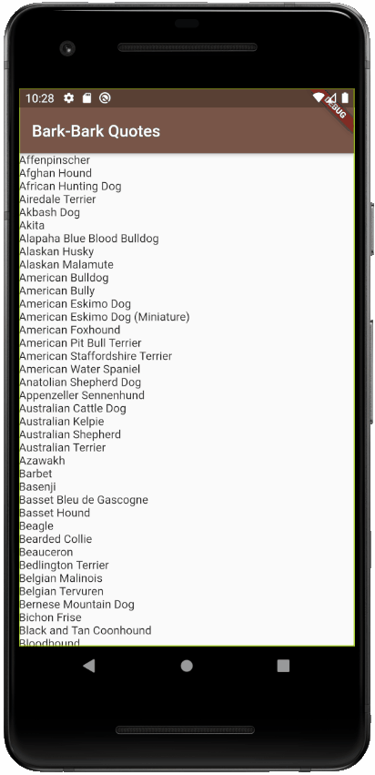
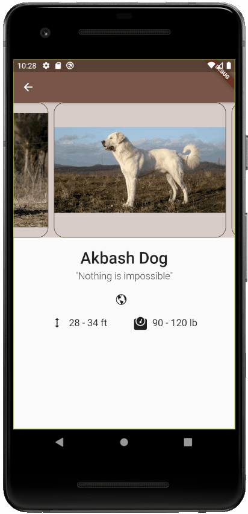

# Beginners' Guide to Flutter Development

Welcome to the Beginners' Guide to Flutter Development hosted by Google's Developer Student Club (DSC) program!

This is an eight week workshop series every Thursday, 7:00 - 8:30 EDT from Oct 1, 2020 to Nov 19, 2020.

This series will cover all the Flutter skills all the way from the basics to the advanced level.
By the end of this series, you'll be able to build complex, robust, and attractive Flutter apps for iOS, Android and the web.

Register now on EventBrite: [bit.ly/flutterdate](https://bit.ly/flutterdate)

Have questions? Then [join our Google Classroom today](https://classroom.google.com/c/MTYyMzE1MDQwMDcx?cjc=5irho7x)!

## 4. Dog Quotes App

What does the Dog say? Baw Baw Baw ...
\# ylvis

### Screenshot

### Structure

* The app has been divided into steps.
* Each step has starter and solution code.
* You can access each code set using the respective branches.
* Also, each step has detailed TODOs along with explanations on why we're doing each TODO.

### How to follow this repo?

* Complete the given TODOs in order.
* Compare the starter and solution branches for each step. You can do this on GitHub or in Android Studio/VS Code.

[How to compare branches on GitHub](https://docs.github.com/en/free-pro-team@latest/github/committing-changes-to-your-project/comparing-commits#comparing-branches)

[How to compare branches on Android Studio](https://medium.com/better-programming/how-to-use-git-in-android-studio-part-2-93cec67b91b0#:~:text=Go%20to%20%E2%80%9CVSC%E2%80%9D%20%2D%3E,choose%20%E2%80%9CCompare%20with%20current%E2%80%9D.&text=A%20popup%20%E2%80%9CCompare%20feature%20with,to%20commits%2C%20files%20to%20files.)

[How to compare branches on Android Studio](https://stackoverflow.com/a/57833947/11547064)

### Steps

1. Setup app

2. Download breed information from the API

3. Design DogCard

4. Create ImagesCarousel

5. Display origin, height, and weight

6. Display lifespan, breedGroup, and bredFor

7. Add tranisition animations for the dog's image

### Skills Learned

* Advanced http requests
* JSON
* ImageCarousel
* CachedNetworkImages
* Card
* ListTile
* Icon
* BorderRadius
* ClipRRect